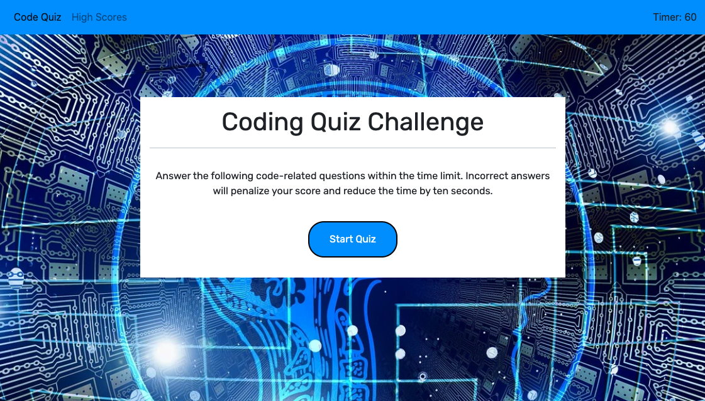

# Code-Quiz-Web-APIs
An app that runs in the browser featuring a multiple-choice quiz testing the user's coding knowledge.

https://seemoregold.github.io/Code-Quiz-Web-APIs/

## Getting Started

Run this application on a default browser like Google Chrome. This application is responsive and will adjust to the user's screen size. Use the dropdown navigation links on the collapsing nav bar on small screens to access the Quiz or High Score pages. Click the 'Start Quiz' button to start the quiz. Then click on the correct answer to gain a point. Click on wrong answer and lose 10 seconds. When the timer reaches 0 the quiz is over.

## Built With

* Visual Studio Code (https://code.visualstudio.com/)
* Bootstrap (https://getbootstrap.com/)
* JavaScript

## Screenshots

## Credits

Tutorials and information on JavaScript, Bootstrap, HTML semantics and accessibility obtained from W3Schools (https://www.w3schools.com/)

## Authors

* **Candice Moreau** - moreau.cj@gmail.com

## License

This project is licensed under the MIT License.

## Acknowledgments

* Background image obtained from Pixabay, a free image resource. (https://www.pixabay.com)
